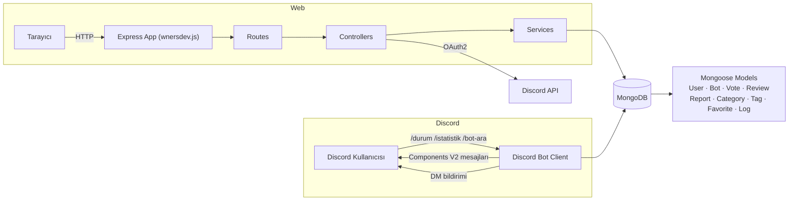

<div align="center">


<br/>


**Discord botlarının keşfedildiği, oylandığı, yorumlandığı ve yönetildiği tam donanımlı bir platform.**
Sıfır `.env`. Sıfır sahte özellik. Sadece çalışan kod. 🔥

</div>

<br/>

## 📚 İçindekiler

- [✨ Özellikler](#-özellikler)
- [🖼️ Demo](#️-demo)
- [🏗️ Mimari](#️-mimari)
- [📂 Klasör Yapısı](#-klasör-yapısı)
- [⚡ Hızlı Başlangıç](#-hızlı-başlangıç)
- [⚙️ ayarlar.json Referansı](#️-ayarlarjson-referansı)
- [🎮 Discord Komutları](#-discord-komutları)
- [🔌 REST API](#-rest-api)
- [🛡️ Güvenlik](#️-güvenlik)
- [🚀 Production Checklist](#-production-checklist)
- [🧭 Yol Haritası](#-yol-haritası)
- [❓ SSS](#-sss)

<br/>

## ✨ Özellikler

<table>
<tr><th>👤 Kullanıcı</th><th>🤖 Bot Sahibi</th><th>🛠️ Admin</th></tr>
<tr>
<td>

- Discord OAuth2 ile giriş
- Bot listesinde arama & filtre
- Cooldown'lu oy verme
- ⭐ Yorum & puanlama
- ❤️ Favorilere ekleme
- 🚩 Bot raporlama

</td>
<td>

- Bot ekleme (sahiplik doğrulamalı)
- Dashboard'dan bot düzenleme
- Canlı istatistikler (oy, görüntülenme, puan)
- Discord DM ile onay/red bildirimi
- Botu tek tıkla silme

</td>
<td>

- 📊 Gerçek zamanlı istatistik paneli
- ✅ Bot onay / red / askıya alma
- 👮 Kullanıcı rolleri & ban
- 🗂️ Kategori & etiket yönetimi
- 🧾 Sistem log kaydı
- ⚙️ `ayarlar.json`'u panelden düzenleme

</td>
</tr>
</table>

**Ekstra:**

| | |
|---|---|
| 🧱 **Components V2** | Discord mesajları eski `Embed` değil, modern `Container` / `TextDisplay` / `Separator` bileşenleriyle |
| 🔍 **Full-text arama** | MongoDB text index ile isim, açıklama ve kategori bazlı arama |
| 📈 **Sıralamalar** | Top / Trending / New — günlük & haftalık oy sayaçlarıyla |
| ⚡ **Cache katmanı** | Popüler botlar, trending ve istatistikler bellek içi cache ile hızlandırılmış |
| 🧯 **Rate limiting** | Hem web hem API için ayrı limitler, `429` sayfası dahil |
| 🚦 **Hata sayfaları** | 404 / 403 / 429 / 500 + bakım modu |

<br/>

## 🖼️ Demo

> 🎬 Buraya projenin ekran kaydı / gif'i gelecek. Aşağıdaki placeholder'ı kendi kaydınla değiştir:
>
> ```markdown
> 
> ```
>
> **Hızlı gif kaydı için:** [ScreenToGif](https://www.screentogif.com/) (Windows) veya `Kap`/`Peek` (Linux) ile 10-15 saniyelik bir akış kaydet: *ana sayfa → arama → bot detay → oy ver → toast bildirimi*. Terminal/komut demosu için [asciinema](https://asciinema.org/) kullanıp aldığın kaydı gömebilirsin:
>
> ```markdown
> [](https://asciinema.org/a/KAYIT_ID)
> ```

<div align="center">

</div>

<br/>

## 🏗️ Mimari



<br/>

## 📂 Klasör Yapısı

```text
wnersdev.js                 🚪 Ana giriş dosyası
ayarlar.json                ⚙️ Tüm yapılandırma (token, DB, limitler...)
package.json

src/
├── api/server.js           🌐 Express app kurulumu
├── database/                🗄️ MongoDB bağlantısı
├── models/                  📦 User · Bot · Vote · Review · Report · Category · Tag · Favorite · Log
├── controllers/             🎯 İş mantığı
├── routes/                  🛣️ Endpoint tanımları
├── middlewares/             🧱 auth · roleAuth · rateLimiter · errorHandler · maintenance
├── validators/              ✅ express-validator şemaları
├── services/                🔧 voteService · statsService · cacheService · logService
├── discord/
│   ├── client.js            🤖 Bot istemcisi
│   ├── commands/             💬 /durum  /istatistik  /bot-ara
│   ├── events/               📡 ready · interactionCreate
│   ├── components/           🧩 Components V2 mesaj şablonları
│   └── notifier.js           📬 DM bildirimleri
└── utils/                    🛠️ config · logger · pagination · apiResponse

public/                      🎨 CSS & JS
views/                       🖼️ EJS şablonları (home, bots, dashboard, admin, errors)
```

<br/>

## ⚡ Hızlı Başlangıç

```bash
# 1. Bağımlılıkları kur
npm install

# 2. ayarlar.json dosyasını doldur (bot token, MongoDB URL, vs.)
#    -> aşağıdaki tabloya bak

# 3. Slash komutlarını yayınla
npm run deploy-commands

# 4. Başlat 🚀
npm start
```

> 💡 Geliştirme sırasında `npm run dev` ile dosya değişikliklerinde otomatik yeniden başlatma alırsın.

### Discord Developer Portal ayarları

1. [discord.com/developers/applications](https://discord.com/developers/applications) → **New Application**
2. **Bot** sekmesi → token'ı kopyala → `ayarlar.json → bot.token`
3. **OAuth2 → General** → Client ID / Client Secret → `bot.clientId` / `bot.clientSecret`
4. **OAuth2 → Redirects** → `http://localhost:3000/auth/discord/callback` ekle → `discord.redirectUri`'a aynısını yaz
5. **Bot** sekmesinde gerekli intent'leri aç (Guilds yeterli)

<br/>

## ⚙️ ayarlar.json Referansı

| Alan | Açıklama |
|---|---|
| `bot.token` | Discord bot token'ı |
| `bot.clientId` / `bot.clientSecret` | OAuth2 kimlik bilgileri |
| `website.port` / `website.url` | Web sunucusu portu ve public adresi |
| `discord.guildId` | Boşsa komutlar **global**, doluysa **tek sunucu** için kaydedilir |
| `discord.redirectUri` | OAuth2 callback URL'i |
| `discord.adminIds` | Otomatik `admin` rolü verilecek Discord ID'leri |
| `database.url` | MongoDB bağlantı string'i |
| `security.sessionSecret` | Oturum imzalama anahtarı — **değiştirmeyi unutma** |
| `security.cookieSecure` | Production'da (HTTPS) `true` yap |
| `vote.cooldown` | Oy verme bekleme süresi (saniye) |
| `limits.*` | Bot/yorum/rapor limitleri, sayfalama boyutu, rate limit değerleri |

<br/>

## 🎮 Discord Komutları

| Komut | Açıklama |
|---|---|
| `/durum` | Site durumunu ve yardım menüsünü gösterir |
| `/istatistik` | Toplam bot, kullanıcı ve oy sayısını gösterir |
| `/bot-ara isim:<sorgu>` | Listedeki onaylı bir botu arar, kart olarak gösterir |

Tüm bot mesajları **Components V2** ile (`Container`, `TextDisplay`, `Separator`, `ActionRow`) modern Discord arayüzünde render edilir — eski `Embed` sistemi kullanılmaz.

<br/>

## 🔌 REST API

| Method | Endpoint | Açıklama |
|---|---|---|
| `GET` | `/api/bots` | Onaylı botları sayfalanmış şekilde listeler |
| `GET` | `/api/bots/:id` | Tek bir botun detayını döner |
| `GET` | `/api/search?q=` | Metin bazlı bot araması |
| `GET` | `/api/categories` | Kategori listesi |
| `GET` | `/api/tags` | Etiket listesi |
| `GET` | `/api/stats` | Genel site istatistikleri |

Tüm yanıtlar `{ success, data, meta? }` formatında tutarlı JSON döner; hatalar `{ success: false, error: { message } }` şeklindedir.

<br/>

## 🛡️ Güvenlik

- ✅ `helmet` ile güvenlik header'ları
- ✅ Oturum tabanlı auth + `httpOnly` çerezler
- ✅ Rol bazlı yetkilendirme (`user → moderator → admin → owner`) — her admin endpoint'i korumalı
- ✅ `express-validator` ile girdi doğrulama & sanitizasyon
- ✅ Web ve API için ayrı rate limit katmanları
- ✅ Oy sisteminde cooldown, kendine oy verme engeli, IP hash kaydı
- ✅ Hassas alanlar (`accessToken`, `refreshToken`) şemada `select: false`
- ✅ Global error handler — stack trace / secret asla kullanıcıya sızmaz

<br/>

## 🚀 Production Checklist

- [ ] `security.sessionSecret` değerini güçlü, rastgele bir değerle değiştir
- [ ] `security.cookieSecure` → `true` (HTTPS zorunlu)
- [ ] `website.trustProxy` → reverse proxy kullanıyorsan `true`
- [ ] MongoDB için düzenli yedekleme
- [ ] Süreç yönetimi: `pm2 start wnersdev.js --name botlist`
- [ ] `npm run deploy-commands` sadece token/guildId değiştiğinde tekrar çalıştırılmalı

<br/>

## 🧭 Yol Haritası

- [x] OAuth2 + rol sistemi
- [x] Oy / yorum / rapor / favori sistemleri
- [x] Admin paneli & site ayarları
- [x] Discord Components V2 bildirimleri
- [ ] Webhook tabanlı sunucu sayısı otomatik güncelleme
- [ ] Bot sahipleri için API key sistemi
- [ ] Çok dilli arayüz (i18n)

<br/>

## ❓ SSS

<details>
<summary><b>Neden .env yok?</b></summary>
<br/>
Proje kuralı olarak tüm yapılandırma tek bir yerden, <code>ayarlar.json</code> üzerinden yönetiliyor. Böylece hem versiyon kontrolü hem de admin panelinden canlı düzenleme daha basit oluyor (bkz. <code>/admin/settings</code>).
</details>

<details>
<summary><b>Global slash komutları neden hemen görünmüyor?</b></summary>
<br/>
<code>discord.guildId</code> boş bırakıldıysa komutlar global kaydedilir ve Discord tarafında yayılması <b>1 saate kadar</b> sürebilir. Test için <code>guildId</code> girip tek sunucuya kaydettirmen çok daha hızlı olur.
</details>

<details>
<summary><b>Bot onaylandığında kullanıcıya nasıl bildirim gidiyor?</b></summary>
<br/>
<code>src/discord/notifier.js</code>, admin onay/red işlemi sonrası bot sahibine Components V2 formatında bir DM gönderir.
</details>

<br/>

<div align="center">


**Beğendiysen ⭐ bırak, katkı yapmak istersen PR aç.**

</div>
